# Understanding chemistry through Python: Consecutive Reactions
Chemists are, unlike physicists or mathematicians, not often related to proficient programming skills. During our first bachelors degree, my fellow students and I were briefly introduced to programming in Python. However, due to the lack of real-world problems, most of us failed to see the true power of Python for scientific computing, automation and data analysis. Many of us, including me, condemned Python to be nothing more than a vague nightmare during our curriculum (yes, the programming course was really hard).

Two years passed before we touched Python again. Our professor in physical chemistry impulsively challenged us to write a program to visualize/simulate a consecutive reaction. Reward for the first 5 succesful implementations: 10% increase on our final course grade!
This made gaining insights in consecutive reactions the first 'real-world' problems that I've tackled with Python. It was also the moment where I started to appreciate Python, up to the point where it is now my most-used (if not only) tool for my research.

It is therefore that I write this small tutorial on a sunday evening with great joy, and hope that I can aspire some other chemists (or scientists in general) to pick up Python programming for their research!

## Theory of consecutive reaction kinetics
Chemical reactions can be roughly separated in elementary reactions and complex reactions. The latter can be understood as a combination of multiple elementary reactions, where an elementary reaction forms a reaction intermediate that serves as a reactant for another chemical reaction. The combination of those steps is then called a reaction mechanism. Unveiling reaction mechanisms is a major focus for many chemists!

In our simple example, we will consider a simple, irreversible consecutive reaction of a component  <!-- $A$ --> 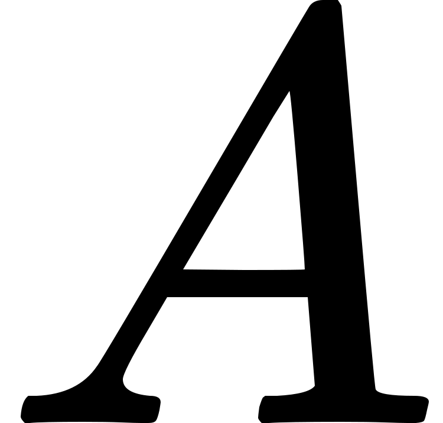 that reacts to <!-- $C$ -->  through intermediate <!-- $B$ --> :
<!-- $$A \xrightarrow{k_1} B \xrightarrow{k_2} C$$ --> 

<div align="center"></div>


### Reaction rate
The rate with which a reactant converts to a product is called a reaction rate. This can however only be conveniently build for elemental reactions. But since we learned that complex reactions are, in the end, a combination of elemental steps with intermediate products, we can thus expect that the reaction rate from a complex reaction is a mathematical combination of elementary reaction rates.

The reaction rate of an elementary reaction depends on the reactant concentration <!-- $[Reactant]$ --> 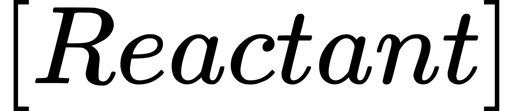 and rate constant <!-- $k$ --> 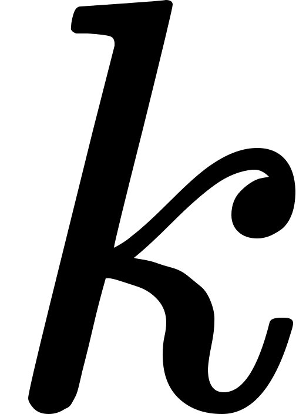.
For the first reaction <!-- $A \xrightarrow{k_1} B$ --> 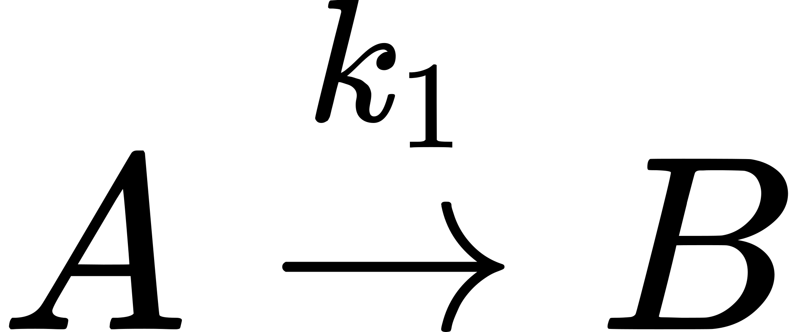, the reaction rate is:

<!-- $$\frac{d[A]}{dt}=-k_1[A]$$ --> 

<div align="center"></div>

This equation shows the change in <!-- $[A]$ -->  over an infinitely small time interval <!-- $t$ --> . <!-- $-k_1$ --> 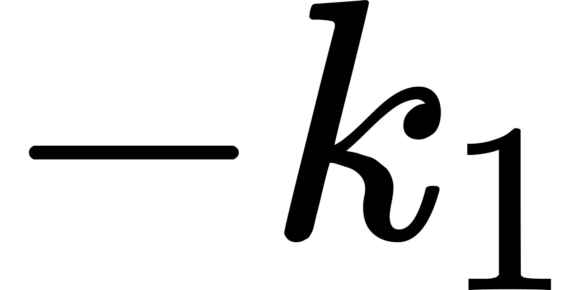 has units <!-- $s^{-1}$ --> 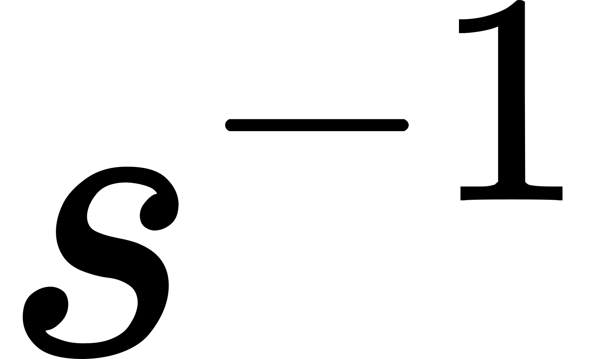, such that the unit of our expression will be in unit <!-- $\frac{mol}{s}$ --> . To have an expression for <!-- $[A]$ -->  after a certain time <!-- $t$ --> , we should integrate the expression over our time interval:
<!-- $$[A]=[A]_0 e^{-k_1t}$$ --> 

<div align="center"></div>

To calculate <!-- $[B]$ --> , we should look at how fast <!-- $B$ -->  is being formed but also to how fast <!-- $B$ -->  reacts to <!-- $C$ --> :
<!-- $$\frac{d[B]}{dt}=k_1[A]-k_2[C]$$ --> 

<div align="center"></div>
Which we can again convert:
<!-- $$[B]=\frac{k_1[A]_0}{k_2-k_1} \left( k_2e^{-k_1t}-k_1e^{-k_2t} \right)$$ --> 

<div align="center"></div>

The last unknown, <!-- $[C]$ --> , is expressed again in a similar way as the conversion from <!-- $[B]$ -->  with rate constant <!-- $k_2$ --> 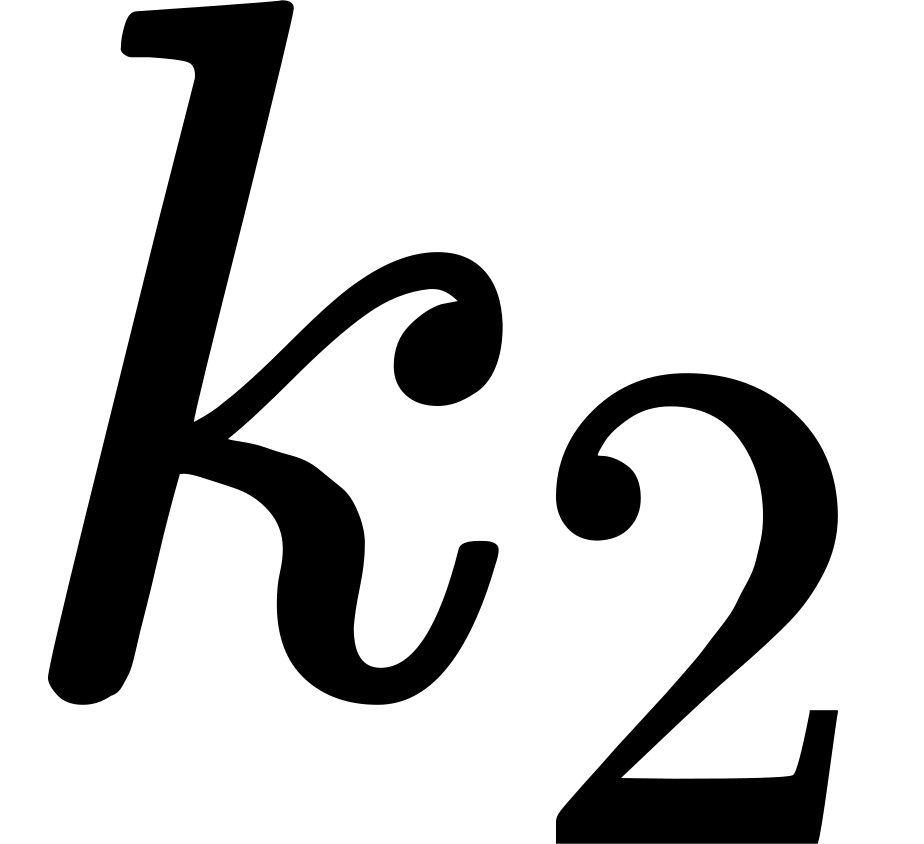:
<!-- $$\frac{d[C]}{dt}=k_2[B]$$ --> 

<div align="center"></div>

By using the previous equations, one can eventually find:
<!-- $$[C]=[A]_0 \left(1+\frac{1}{k_1-k_2}\left( k_2e^{-k_1t}-k_1e^{-k_2t}\right) \right)$$ --> 

<div align="center"></div>

It is interesting that, given the rate constant for the reactions, all concentrations at time <!-- $t$ --> 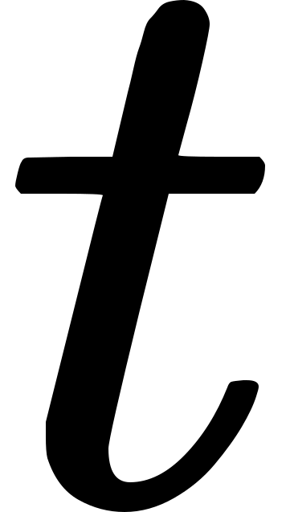 can be calculated from the initial concentration of reactant  <!-- $[A]$ --> 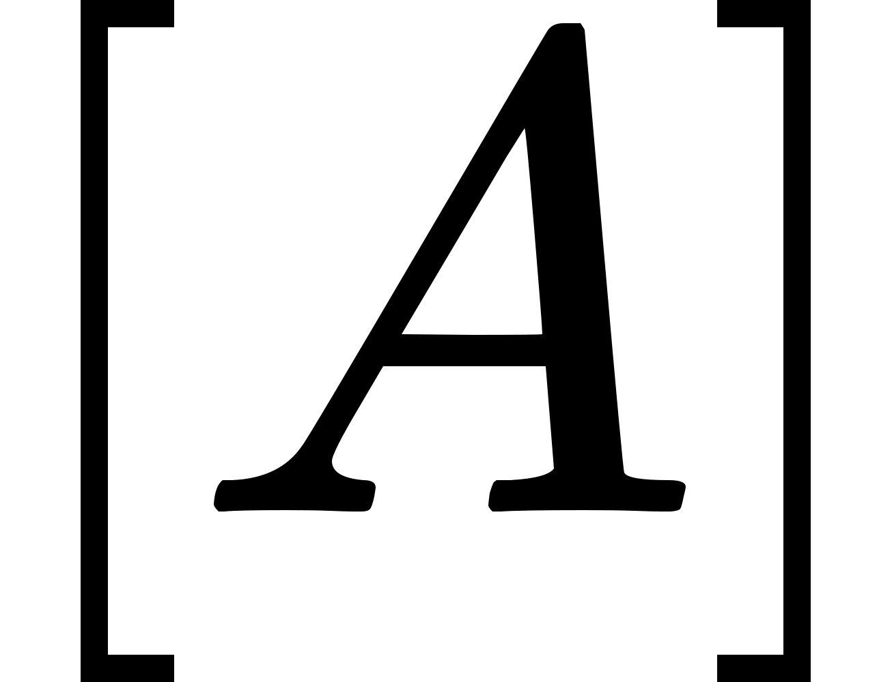. Now let's go the fun part and implement this in Python!

--------------------------------------------------------------

## Implementation in Python
### Installation of Dependencies
I assume that you have already installed python on your system. If not, there are plenty of tutorials available on how to do so for your operating system. Further, we rely on 2 modules: `numpy` and `matplotlib`. `numpy` is a linear algebra library that allows us to use arrays to represent vectors and matrices. Apart from the mathematical operations that it introduces, it is blazing fast compared with standard Python code! `Matplotlib` on the other hand is a widely used library to plot high-quality, publication-ready graphs and figures of your data.

You should check if you have installed these by importing them in a Python shell:
```python
$ python

>>> import numpy as np
>>> import matplotlib.pyplot as plt
```
When running those lines, you should just be prompted a new line without any output. If you receive an error in one of those lines, you most likely haven't installed them.
you can conveniently install these through `pip` by running (in a Bash shell!):
```
$ pip install [package]
```

To install matplotlib and numpy, you should therefore run:
```
$ pip install numpy
$ pip install matplotlib
```

Now retry to import them in a Python shell

### Calculating the concentrations
The time and concentration data will be represented as numpy vectors. Therefore, we should first import the numpy library by running `import numpy as np`.
Now we can proceed to implement the derived equations in Python. First of all, we should define the initial concentration of <!-- $[A]$ --> , the time interval of interest and the rate constants of the two elemental reactions:
```python
time = np.arange(0.0, 5.0, 0.001)
conc_A_0 = float(10)
k1, k2 = 1, 2
```
Here we created a numpy vector `time` that represents our time interval. It starts at `t=0.0` seconds up until `t=4.999` seconds with intervals of 1 millisecond. Subsequently, we set the initial concentration of <!-- $[A]_0$ -->  to 10 <!-- $\frac{mol}{L}$ --> 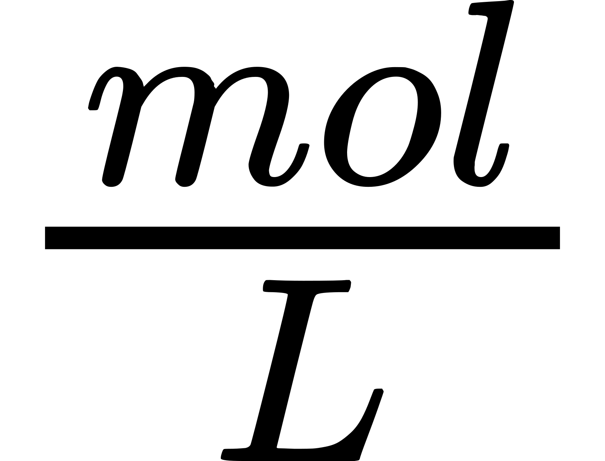. Finally, we set the rate constant for reactions to 1 and 2. Feel free to play around with those values or implement an interactive way to change them! (hint: look at [matplotlib sliders](https://matplotlib.org/stable/gallery/widgets/slider_demo.html))

For <!-- $[A]$ --> , the equation is fairly simple:
```python
conc_A = conc_A_0 * np.exp(-k1*time)
```

The equations of <!-- $[B]$ -->  and <!-- $[C]$ --> 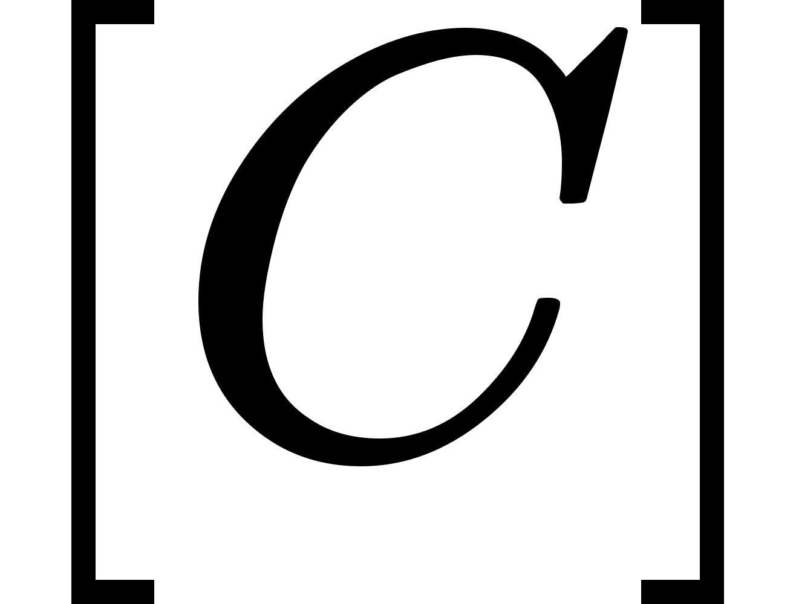 are a bit more complicated, but rather straightforward nonetheless:
```python
conc_B = conc_A_0 * (k1/(k2-k1))*(np.exp(-k1*time)-np.exp(-k2*time))
conc_C = conc_A_0 * (1 + (1/(k2-k1))*(k1 * np.exp(-k2 * time) - k2 * np.exp(-k1 * time)))
```

### Plotting the data
To plot the data, we rely on matplotlib. It is by far the most used plotting and graphing library available for Python. You can import it by running `import matplotlib.pyplot as plt`.

Now we can create a `figure()` and `axes` object by running:
```python
fig, ax = plt.subplots()
```

Plotting the 3 concentrations in function of time requires the following lines of code:
```python
ax.plot(conc_a, time, label='concentration A')
ax.plot(conc_b, time, label='concentration B')
ax.plot(conc_c,	time, label='concentration C')
```

Now making the graph a bit nicer by setting labels and including a legend:
```python
ax.ylabel('concentration (mol/l)')
ax.xlabel('time (s)')
ax.legend(True)
```

And our plot is ready! You can view it by running `plt.show()` after running all the previous lines.


As we can see, the concentration of <!-- $A$ -->  starts at <!-- $[A]_0$ --> 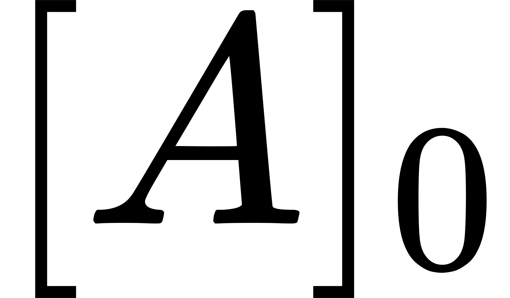 but immediately converts irreversibly to <!-- $B$ --> , causing a surge in concentration of <!-- $B$ --> . But remember that <!-- $B$ --> 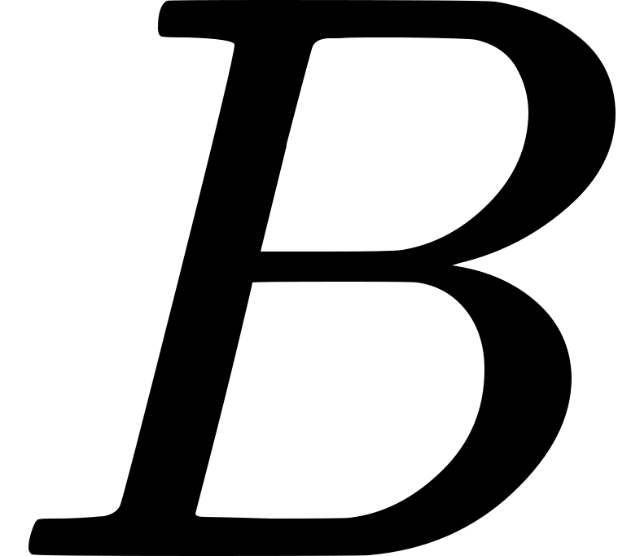 is the fuel for the second elemental reaction: <!-- $C$ -->  is being formed! Now that the amount of <!-- $A$ -->  in the system is drastically decreasing, the formation of <!-- $B$ -->   slows down. The conversion rate of <!-- $B$ -->   to <!-- $C$ --> 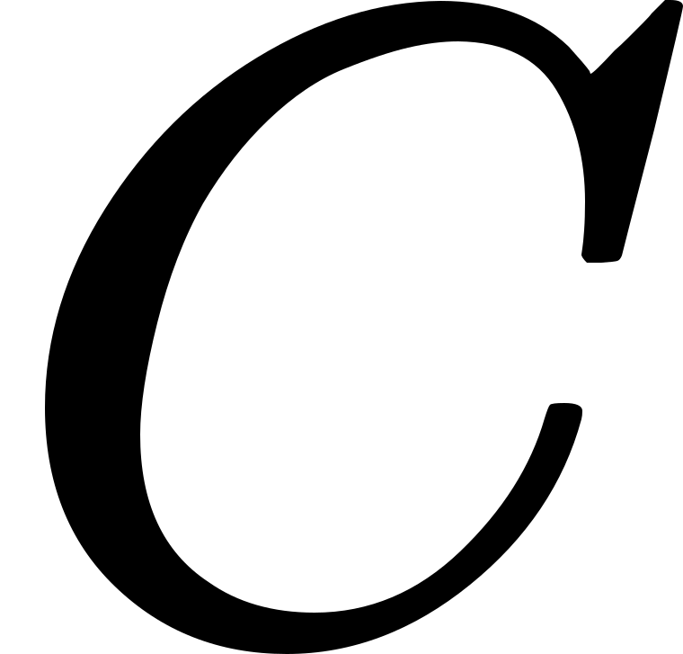 still increases, up until the conversion to <!-- $C$ -->  is faster than the formation of <!-- $B$ --> : we have reached our maximum <!-- $B$ -->  concentration in our time interval. Now it is just a matter of time before everything is converted to <!-- $C$ --> .

### Total Script
```python
# import the libraries
import numpy as np  # numerical library
import matplotlib.pyplot as plt  # graph-plottig library

# Set up the initial information
k1 = 1
k2 = 2
conc_A_0 = float(10)
time = np.arange(0.0, 5.0, 0.001)

# Calculate the concentrations of the 3 components
conc_A = conc_A_0 * np.exp(-k1*time)
conc_B = conc_A_0 * (k1/(k2-k1))*(np.exp(-k1*time)-np.exp(-k2*time))
conc_C = conc_A_0 * (1 + (1/(k2-k1))*(k1 * np.exp(-k2 * time) - k2 * np.exp(-k1 * time)))

# plot the data
fig, ax = plt.subplots()

ax.plot(time, conc_A, label='concentration A')
ax.plot(time, conc_B, label='concentration B')
ax.plot(time, conc_C, label='concentration C')

ax.set_ylabel('concentration (mol/l)')
ax.set_xlabel('time (s)')
ax.legend()

plt.show()

```

## Closing Remarks
We've succesfully modeled a simple, fictive consecutive reaction! You could now search for other complex reactions with multiple intermediates and try to model those as well. 

I hope you liked this basic tutorial, and feel free to give feedback and suggestions or request a particular tutorial.
